# TP4 PPSE
DEBRIE Maëla
WILCOX Grace

## Execution
To execute our code, you need to install the GSL library on your computer : 
- `sudo apt-get install libgsl-dev` on Linux and on the Jetson
- On Mac, `brew install gsl` seems to be enough

To compile : `gcc simulator.c -o simulator.x -Wall -std=c99 -I/usr/include/gsl -lgsl -lgslcblas -lm <-DENABLE_STATS>`. Our Makefile doesn't seem to work on the Jetson for now.
To simulate : `./simulator.x -m [min_SNR float] -M [max_SNR float] -s [step_val float] -e [f_max uint] -K [info_bits uint] -N [codeword_size uint] -D ["rep-hard"|"rep-soft" string] -f [sim_name string] `

## Task 0 - Throughput
To increase accuracy, all of our times will now be written in μs. We then compute the throughput with `sim_thr = (float)n_frame_simulated * info_bits / elapsed`. 

## Task 1 - Block stats
We change our code to be able to compute stats per block.
- When `-DENABLE_STATS` is written on compile line, stats per block will be activated.
- We test this in our code with 
```
#ifdef ENABLE_STATS 
... 
#end if
``` 
- When enabled, we instantiate some more variables, and we measure time before calling the block function, as well as after it returns. We then compute the elapsed time.
- We keep track of the min and the max by storing them in an array and comparing after each iteration. We initialize those arrays at value +Infinity (for the min array) and -Infinity (for the max array).
- We keep track of the average by adding the time for each iteration, then dividing it by the number of iteration for this SNR.
- We compute the percentage by dividing by the total elapsed time, excluding the time spent computing.
- We store those newly computed data in a separate .csv, appending "_stats" to the name specified in the command line. **Beware, this CSV has many columns and PPython MatPlotLib / Pandas parses it wrong**. 

## Task 2 - Source all zeros
We just take our previous function, modifying it to remove the rand() and only produce zeros.   
We have to change the function to parse arguments to `getopt_long` to adapt to this change.

How to use `getopt()` :
- We use getopt to parse command line arguments. An option is a parameter beginning with '-' (different from only "-" or starting with "--").
- The signature is `getopt (argc, argv, format)`.
  - Format is a string containing all valid options (as letters) to be parsed. 
  - If one of those chars is followed by a ':', it means it expects an argument after. 
  - It is the case for all of our arguments. The following argument is then stored in optarg variable.

Changes for `getopt_long()`
- For short commands (`-a`), nothing changes.
- To parse long commands, we need more variables :
  - `struct option zero_opt[]` is an array of `struct option`. It stores every long option we can encounter.
  - A `struct option` is {name, is_arg, flag, val} :
    - name is the name of the long command, without the leading "--"
    - is_arg is one of "no_argument", "required_argument" or "optional_argument". The meaning is obvious.
    - We do not use flag here.
    - val is the value to return when we encounter a long command. It is this value that we need to add in our switch case.

While testing, we note that it is way longer to simulate the hard decoder for only zeros compared to random numbers, indicating that the hard decoder performs better with all zeros. For testing purposes, we decide to modify the generator to only produce ones to see if that makes a difference; we note that only ones is quicker than random numbers, and therefore the hard decoder's performance is worse. This difference in performance can be attributed to the fact that the hard decoder is biased in favor of zeros when the sum of the repetitions is ambiguous (=0) : `(average<0?1:0)`. For the soft decoder, which is much less likely to end up with a sum of 0 (because the addition is performed _before_ rounding), the performances are the same.
_For hard decode :_
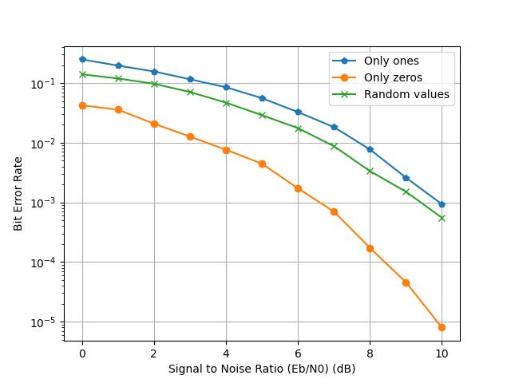
_For soft decode :_
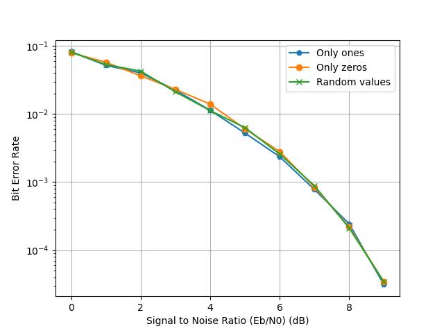

In terms of throughput, we find that it is in fact quicker to generate only zeros or only ones compared to random inputs, probably due to the cost of computing a random number and dividing it by 2.

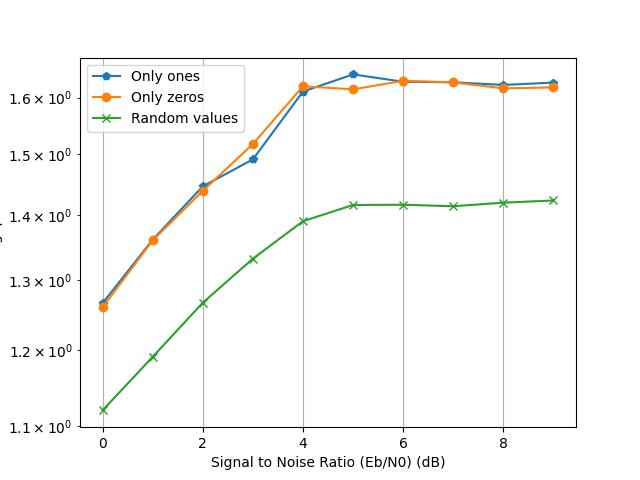

## Task 3 - Modulate all ones
We proceed the same way as we did with the generator.  
We find that the thoughput is the same because the cost of computing `(CN[n-1]?-1:1)` is negligeable (no branch).  

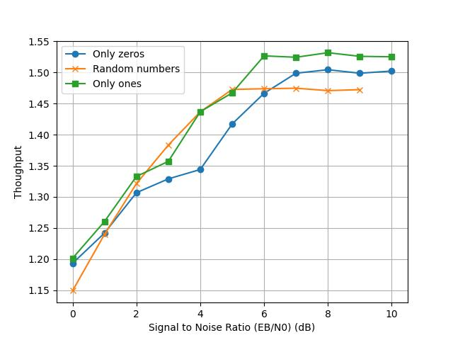

But we find that the decoding performances are way worse, always at 0.5 BER. That is because we ignored the original message, so approximately half of the bits are modulated wrong ; to really see the impact on decoding, we combine it with the all-zero source. We then find once again the same decoding performances seen in Task 2.

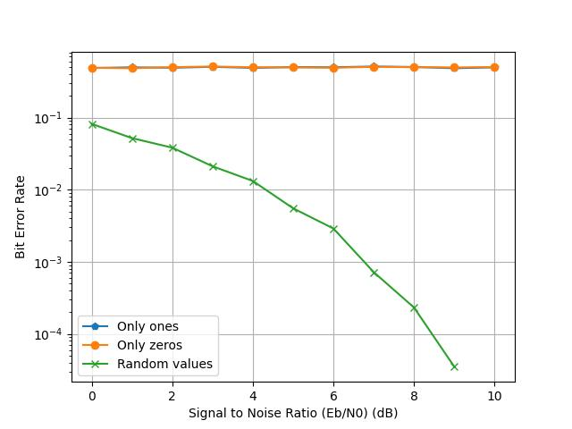


## Task 4 - Fixed point
In order to convert the floating point values sent over the channel, we implement a quantizer that produces fixed-point values of S bits with f bits for the fractional part:
$$ Q = min(max([2^f *N],-2^{s-1}),2^{s-1}-1) $$

We also had to adapt the soft and hard decode functions to work with 8-bit integers. In our testing, we found that hard decoder demonstrated abnormally poor performance; we discovered that with the loss of precision, the quantizer was transforming small-magnitude numbers into zeros, which were then skewing the decode results. To resolve this, we added to our quantizer a final test to see if the result is zero. In this case, instead of passing a zero to the decoder, we instead take the smallest magnitude value matching the sign of the original input. This allows the hard decoder to receive a true representation of the sign of the transmitted bit, without over-inflating the magnitude too much for the soft decoder.

Another error that we ran into was matching the range of the numbers to that of the quantizer. In 8-bit fixed point, we have a much more constricted range of values than in floats, and therefore if the input values do not fit into that range, we lose information, which was especially evident in the soft decode. In order to avoid this, we modify the demodulator to scale all bits by $\frac{s}{sigma^2}$. Because sigma is proportionnal to the amount of noise added, and a larger noise value results in larger values coming out the channel, this factor provides a more consistent normalization of the values to keep them in a similar range for the quanitizer.

To use the quantizer via the command line, because the 2 function signatures are different, we choose to have 2 function pointers and a flag to tell us which one to use. When we detect through command line that we want to use a fixed-point function, or that we specified a --qf parameter, this flag is set to 1, meaning we want to use the fixed-point version. Using the --qs parameter have no effect on this flag if we do not specify that we want to use the fixed-point version of the function.

## Task 5 - Decoding performances in fixed-point
We run all the possible combinations of f and s for each sim, then we trace the graphs for each sim to determine visually which combination is the best one. We note that with S = 8, we are always saturated because we consider signed values, so we only consider S values below 8. In general, the larger the value of S, the better the performance. We want to limit S (to reduce the number of bits used), however, so we stick with middle values of S=4-6 and evaluate the remaining combinations visually. By process of elimination, we end up with :
- Sim 1 : S = 5, F = 4
- Sim 2 : S = 5, F = 2
- Sim 3 : S = 5, F = 3
- Sim 4 : S = 5, F = 3
- Sim 5 : S = 5, F = 4

## Task 6 - SIMD
We begin by changing the command line parser to adapt to the new neon options.  
Then we implement the hard and soft decoder :

### Hard decoder
K is a multiple of 16, so we will do K/16 iterations of this treatment.  

We iterate on each part of the array (`array_nb = K/16`), and on each repetition of this part of the array (`n_reps`), we do :
- Loading this part of the array
- Hard-deciding it 
- Because the `vcltzq_s8` returns -1s and 0s, we do a little treatment to get -1 if we had below 0 and +1 if we had above 0.
- We then sum this array into a temporary result
- Once the sum is done, we have the results of the majority vote. We once again do a `vcltzq_s8` to determine if the sum was below 0 (meaning we should infer a 1) or above 0 (meaning we should infer a 0).
- `vcltzq_s8` returns -1 when we should infer a 1 - we just have to do an "and" between this -1 (0b11111111) and a 1 (0b00000001) to get a 1 back. The 0s are not affected.

When doing the simulation with the Neon version, the fixed-point version, and the original version, we see that all are approximately the same results.
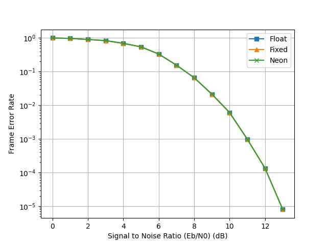

When comparing the throughputs for one frame, we see that floating point has the best throughput of the 3. We assume it is because it takes more time to transform floats into fixed-point, which causes a reduction in the throughput. We note that the quantizer function uses floating point multiplication as well as several functions found in the math library and therefore has a high overhead.
When comparing between fixed-point and neon, we find that vectorial instructions do have a better throughput, which is what we expected.
Note: Because of the Y-axis values taking so much space, the Y axis legend seems to be out of frame. It is in fact "Throughput (Mbps)".
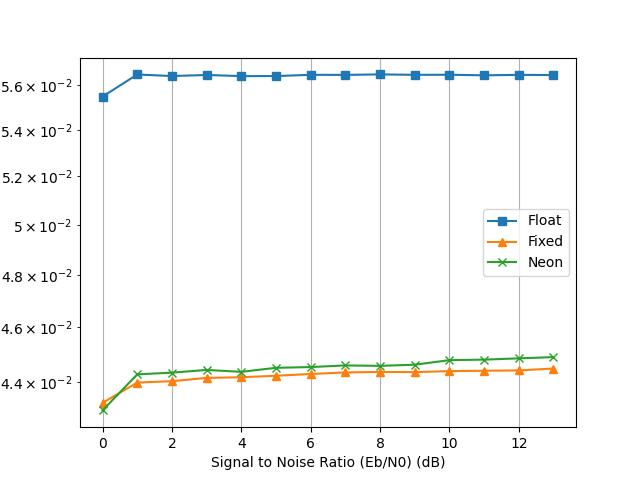

We also compared the execution times for decoding one frame. We assume fixed-point is a bit quicker than floating-point because fixed-point works on 8-bit values while floating-point works on 32-bits, but the difference is very small. On the other hand, SIMD decoding is much quicker than its scalar counterpart, by approximately 8 times. This is what we expected: we are treating 8 elements at once in the SIMD version, but because the code is a bit more complicated because of the instructions we could use, it is not exactly 8 times quicker. It is still a significant time.
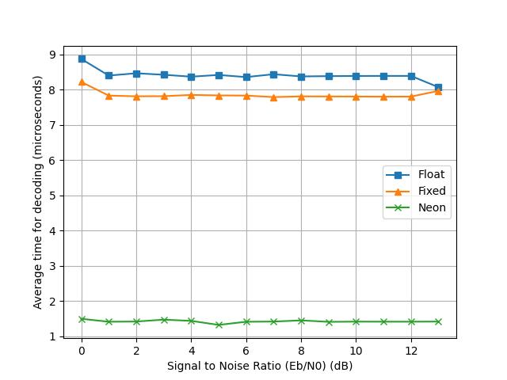

### Soft decoder
Because we are limited to 16-wide vectors, we traverse the message 16 numbers at a time. For each repetition, we iteratively load 16 numbers and add them to a vector holding the average. For messages longer than 16 numbers, we have multiple average vectors (stored in an array) that we use over the course of one repetition. After traversing the entirety of the input array, we iterate one final time over all of the average vectors to determine whether each sum (16 per vector) is positive or negative. We note that the vectoral instruction `vcltzq_s8` that checks whether each vector slot is less than zero returns either 0xFF or 0x0. In order to convert this to a 1 or 0 (the format expected as output of the decode), we use a bit mask with the LSB. 

In comparing the performances of the three soft decode methods, we see that they all produce the same error rates at the same SNR. This is desirable since we didn't want our optimization efforts to compromise the error rate.
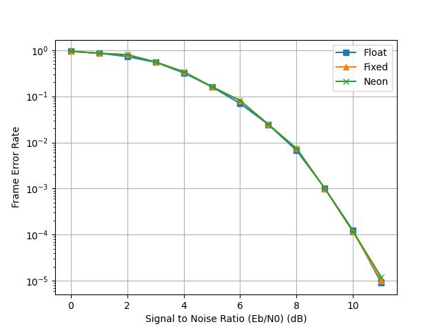

Another key metric with which to evaluate the different decoding methods is the throughput, which is a measure of the production rate of messages through the entire simulation chain. Like for hard decode, the floating point method has the highest throughtput (produces and treats the most bits per second); once again, this can be attributed to the extra time needed for the quantizer to convert to fixed point which is not used in the floating point decode. This assumption is supported by the fact that the two fixed-point methods (fixed point scalar + vectoral) have very similar throughput values, with the vectoral method - being able to treat multiple data in parallel - narrowly beating the scalar method. Another point to note is that the throughput rises with SNR for these two methods, unlike the float, which remains relatively constant with SNR.
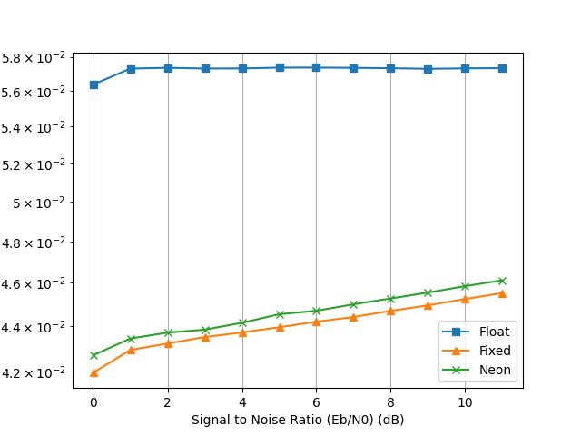

Lastly, we compare the methods in terms of time spent specifically in the decoding block. We see that the fastest decoder is clearly the vectoral SIMD method, at just over 2 microseconds a fram. The floating point method is the slowest with a time of around 12 microseconds per frame; this result shows just how computationally heavy floating-point arithmetic is on the processing unit. Fixed-point falls in the middle of the two methods at just over 6 microseconds a frame, benefitting from the lack of floating-point computations but missing out on the parallelization offered by the SIMD instructions.
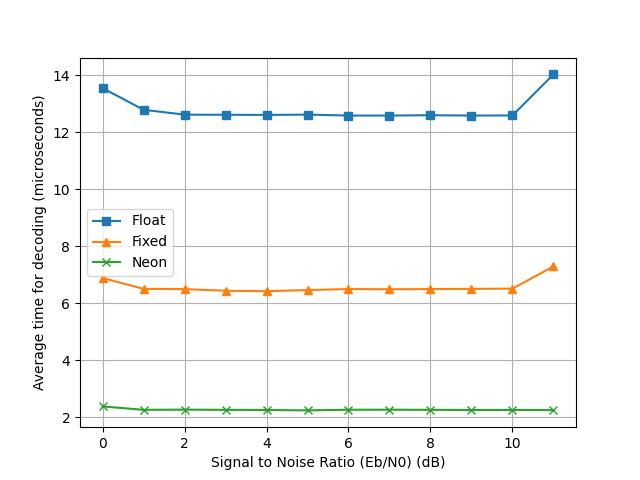
Note: Because of the Y-axis values taking so much space, the Y axis legend seems to be out of frame. It is in fact "Throughput (Mbps)".