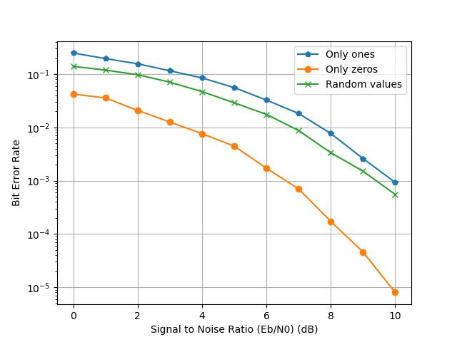
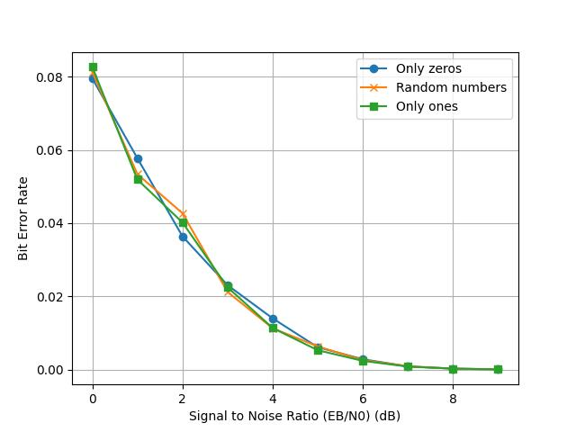
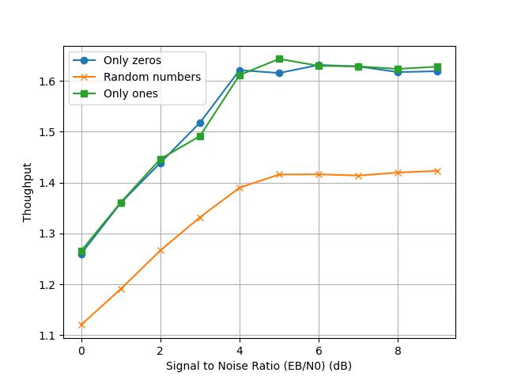
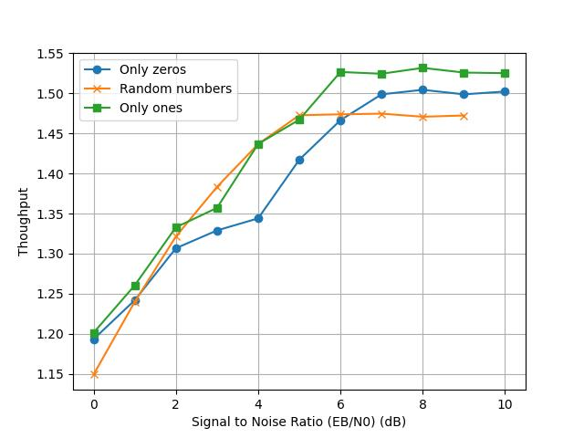
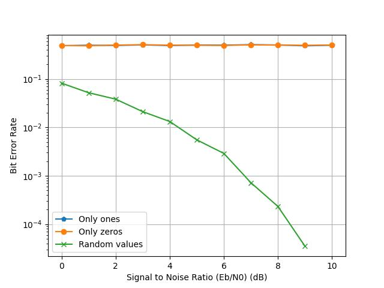
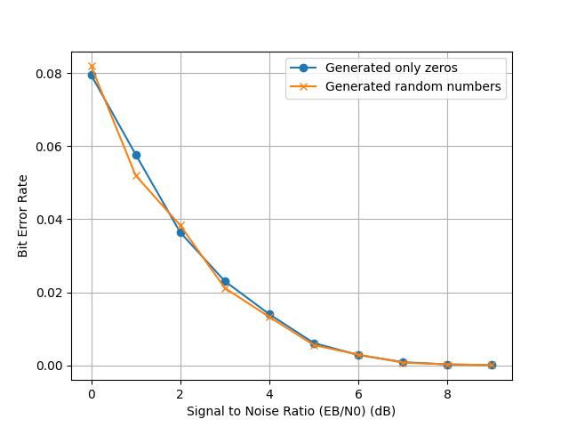

# TP4 PPSE
DEBRIE Maëla
WILCOX Grace

## Execution
To execute our code, you need to install the GSL library on your computer : 
- `sudo apt-get install libgsl-dev` on Linux and on the Jetson
- On Mac, `brew install gsl` seems to be enough

To compile : `gcc simulator.c -o simulator.x -Wall -std=c99 -I/usr/include/gsl -lgsl -lgslcblas -lm <-DENABLE_STATS>`. Our Makefile doesn't seem to work on the Jetson for now.
To simulate : `./simulator.x -m [min_SNR float] -M [max_SNR float] -s [step_val float] -e [f_max uint] -K [info_bits uint] -N [codeword_size uint] -D ["rep-hard"|"rep-soft" string] -f [sim_name string] `

## Task 0 - Throughput
To increase accuracy, all of our times will now be written in μs. We then compute the throughput with `sim_thr = (float)n_frame_simulated * info_bits / elapsed`. 

## Task 1 - Block stats
We change our code to be able to compute stats per block.
- When `-DENABLE_STATS` is written on compile line, stats per block will be activated.
- We test this in our code with 
```
#ifdef ENABLE_STATS 
... 
#end if
``` 
- When enabled, we instanciate some more variables, and we measure time before calling the block function, as well as after it returns. We then compute the elapsed time.
- We keep track of the min and the max by storing them in an array and comparing after each iteration. We initialize those arrays at value +Infinity (for the min array) and -Infinity (for the max array).
- We keep track of the average by adding the time for each iteration, then dividing it by the number of iteration for this SNR.
- We compute the percentage by dividing by the total elapsed time, excluding the time spent computing.
- We store those newly computed data in a separate .csv, appending "_stats" to the name specified in the command line. **Beware, this CSV has many columns and PPython MatPlotLib / Pandas parses it wrong**. 

## Task 2 - Source all zeros
We just take our previous function, modyfing it to remove the rand().  
We have to change the function to parse arguments to `getopt_long` to adapt to this change.

How to use `getopt()` :
- We use getopt to parse command line arguments. An option is a parameter beginning with '-' (different from only "-" or starting with "--").
- The signature is `getopt (argc, argv, format)`.
  - Format is a string containing all valid options (as letters) to be parsed. 
  - If one of those chars is followed by a ':', it means it expects an argument after. 
  - It is the case for all of our arguments. The following argument is then stored in optarg variable.

Changes for `getopt_long()`
- For short commands (`-a`), nothing changes.
- To parse long commands, we need more variables :
  - `struct option zero_opt[]` is an array of `struct option`. It stores every long option we can encounter.
  - A `struct option` is {name, is_arg, flag, val} :
    - name is the name of the long command, without the leading "--"
    - is_arg is one of "no_argument", "required_argument" or "optional_argument". The meaning is obvious.
    - We do not use flag here.
    - val is the value to return when we encounter a long command. It is this value that we need to add in our switch case.

While testing, we note that for some reason, it is way longer to simulate the hard decoder for only zero compared to random numbers. While testing, it seems that only ones is quicker that random numbers.  
We can see that for our hard decoder, only zeros has a better decoding performance, while only ones does worse. This is because our hard decision is biased in favor of zeros when the number of repetitions is even : `(average<0?1:0)`. But for the soft decoder, the performances are the same. 
_For hard decode :_

_For soft decode :_


In terms of throughput, we find that it is in fact quicker to generate only zeros or only ones compared to random, probably because of the cost of computing a random number and dividing it by 2.




## Task 3 - Modulate all ones
We proceed the same way as we did with the generator.  
We find that the thoughput is the same, because the cost of computing `(CN[n-1]?-1:1)` is negligeable (no branch).  



But we find that the decoding performances are way worse, always at 0.5 BER. That is because we ignored the original message, so apprix. half of the bits are modulated wrong ; to really see the impact on decoding, we combine it with the all-zero source. We then find once again the decoding performances seen at Task 2.





## Task 4 - Fixed point
**TODO GRACE**
To change it through the command line, because the 2 function signatures are different, we choose to have 2 functions pointers and a flag to tell us which one to use. When we detect through command line that we want to use a fixed-point function, or that we specified a --qf parameter, this flag is set to 1, meaning we want to use the fixed-point version. Using the --qs parameter have no effect on this flag if we do not specify that we want to use the fixed-point version of the function.

## Task 5 - Decoding performances in fixed-point
We run all the possible combinations of f and s for each sim, then we trace the graphs for each sim to determine visually which combination is the best one. We note that with S = 8, we are always saturated because we consider signed values, so we only consider S values below 8. We proceed by elimination, and we find those values :
- Sim 1 : S = 5, F = 4
- Sim 2 : S = 5, F = 2
- Sim 3 : S = 5, F = 3
- Sim 4 : S = 5, F = 3
- Sim 5 : S = 5, F = 4

## Task 6 - SIMD
We begin by changing the command line parser to adapt to those new neon options.  
Then we implement the hard and soft decoder :

**Hard decoder**
K is a multiple of 16, so we will do K/16 iterations of this treatment.  

We iterate on each part of the array (`array_nb = K/16`), and on each repetition of this part of the array (`n_reps`), we do :
- Loading this part of the array
- Hard-deciding it 
- Because the `vcltzq_s8` returns -1s and 0s, we do a little treatment to get -1 if we had below 0 and +1 if we had above 0.
- We then sum this array into a temporary result
- Once the sum is done, we have the results of the majority vote. We once again do a `vcltzq_s8` to determine if the sum was below 0 (meaning we should infer a 1) or above 0 (meaning we should infer a 0).
- `vcltzq_s8` returns -1 when we should infer a 1 - we just have to do a "and" between this -1 (0b11111111) and a 1 (0b00000001) to get a 1 back. The 0s are not affected.

When doing the simulation with the Neon version, the fixed-point version, the original version as well as the randomized original version (comparison point), we see that all are approximately the same results. 

**todo throughput comparison**

