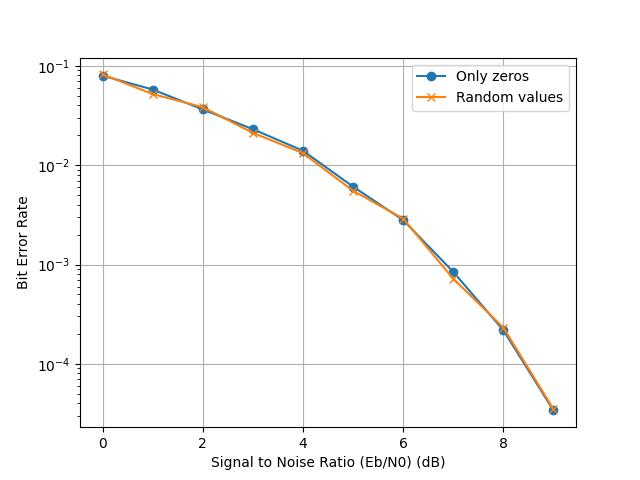

# Concernant la génération
- On a constaté que pour la simulation hard, on prend beaucoup plus de temps à traiter uniquement des 0 comparé à random, qui est aussi + long que uniquement des 1. On compare donc avec que des 0 et que des 1.
- Le temps est affiché en microsecondes
- On constate que le nombre d'erreurs est assez similaire peu importe ce qu'on génère, sauf pour la simulation en hard-decode (peut-être un biais de décodage en hard, pour un nombre pair de répétitions ? Peut être un défaut d'implémentation ? Peut-être des moins bonnes performances ?)

- On constate que le thoughput est meilleur quand on génère toujours la même valeur. Pourquoi? On génère toujours la même chose donc ca me semble bizarre

# Concernant la modulation
- les temps sont toujours en microseconds
- le thoughput est équivalent , parce que changer la manière de moduler ne change pas la vitesse de traitement

- les performances de décodage sont largement réduites, puisqu'on fait totalement fi de l'entrée et on force une modulation vers 1. De manière logique, on a fait une mauvaise modulation sur environ la moitié des bits, donc on a un taux d'erreur de 1/2

- Pour référence, on compare avec à la fois une génération de 0 et une modulation de 1. On constate alors qu'il n'y a aucun effet sur les performances de décodage (encore une fois, sauf pour la décision dure -> pourquoi?)

# Task 5 
## Sim 1
S5F4

-> s=8 on sature toujours