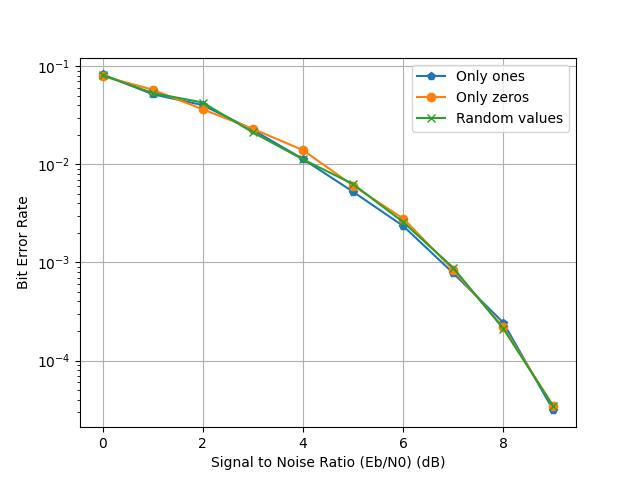
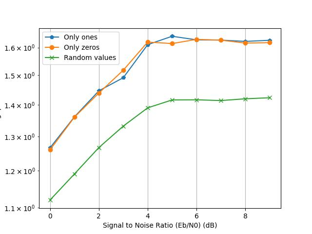

# Concernant le temps de génération
- On a constaté que pour la simulation hard, on prend beaucoup plus de temps à traiter uniquement des 0 comparé à random, qui est aussi + long que uniquement des 1. On compare donc avec que des 0 et que des 1.
- Le temps est affiché en microsecondes
- On constate que le nombre d'erreurs est assez similaire peu importe ce qu'on génère, sauf pour la simulation en hard-decode (peut-être un biais de décodage en hard, pour un nombre pair de répétitions ? Peut être un défaut d'implémentation ? Peut-être des moins bonnes performances ?)

- On constate que le thoughput est meilleur quand on génère toujours la même valeur. Pourquoi? On génère toujours la même chose donc ca me semble bizarre
