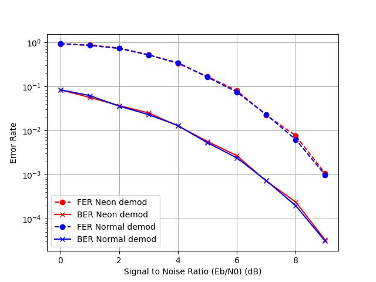

# Projet PPSE
DEBRIE Maëla
WILCOX Grace

# Axe 1 - Speedup the whole chain
## Using threads
We will use mutex (locks) to avoid concurrent access on the frame error and bit error variables. Because we will run multiple threads at once, we might stop above `f_max` frames simulated.


**todo rédiger**
Changer le monitor pour qu'il prenne des verrous en paramètre
Rajouter 2 verrous pour le count fer et le count ber (permet de pipeliner un peu)
On join les threads après la boucle while et on les crée au début, APRES le reset de la variable (comme ca pas besoin de locks pour ca) 
On a besoin de mettre les pointeurs de fonction en global pour les partager - pas un problème vu que c'est les mêmes pour tous les threads et non modifié
On a 6 CPU : on va faire 6 threads

On a du refaire tout le code à cause de comment c'était : on passe toutes les variables en global pour qu'on puisse y accéder dans la routine sans passage de param (impossible)
Du coup on a testé qu'on n'a pas cassé le code avec une ancienne sim

Ce qu'on a fait:
Rajout d'un flag -t pour activer les threads
Pas le choix du nombre, on en met 1 par core donc 6 en tout
On déplace tout le do while dans une fonction qu'on appelle
On join à chaque fois qu'on a atteint le nombre max d'erreurs, pour que le programme principal fasse les calculs et l'écriture dans un fichier
Puis on re split pour le SNR suivant

Pour les mutex : on les re-déclare en extern dans le monitor.h pour qu'il n'y ait pas d'erreur de compilation vu que ces fonctions les utilisent
On limite le temps de prise de verrou au max (juste 1 lecture/écriture)

On doit un peu ré-arranger le code pour qu'il compile sans erreurs


# Axe 2 - Optimize one blockwith SIMD

## Optimize modulator
In order to optimize the modulator block, the original code is adapted to be used with neon SIMD functions. As a reminder, our modulator uses binary phase key shifting (BPSK) to transform a binary message to a symbol which is then converted to an integer value for transmission.
```
binary | symbol | integer
   0  ->   1   ->    1
   1  ->   0   ->   -1
```

Instead of parsing and converting the binary values one by one, the incoming binary codeword is treated 16 elements at a time by first loading 16 8-bit integers from memory into a vector. These 16 elements are then evaluated to determine whether they are a '1' or a '0' using the vectoral instruction `vcgtzq_s8`; the corresponding element in the 16-wide return vector is set to `0xFF = -1` if the input element was greater than 0, or to 0 otherwise. We can then manipulate this new vector by doubling it to create a difference of 2 between our two element types, and then adding one to shift these values, resulting in -1 or 1. This process is summarized below:
```
  in  | >0 ? |  x2  |  +1 
  0  ->  0  ->  0  ->  1 
  1  -> -1  -> -2  -> -1
```

It is of note that the input data type to the modulator is `uint8_t`, while the output is `int32_t`; the modulator must also convert each element from 8 to 32 bits. This process is facilitated using `vmovl` functions that allow for conversion between different width elements in SIMD. The complexity here, however, lies in the different length of each vector. Because the overall register size is constant, one SIMD register can only hold 4 32-bit integers. Therefore, four `int32x4_t` vectors are needed to hold the output produced by one `int8x16_t` vector. Additionnally, 2 16-element vectors are needed as intermediaries as the `vmovl` functions only provide conversion between adjacently sized vectors (8bit -> 16bit -> 32bit).

Once the modulated message has successfully been transferred to the 32 bit vectors, the result can be stored to the destination 32bit array.

Given that this implementation provides a third modulator option, the `--"mod-all-ones"` long option is replaced by `-o` which can take either `"mod-all-ones"` or `"mod-neon"`. If the `-o` option isn't used, the default, scalar BPSK modulator is used.

**Testing**
To test the functionality of the modulator, a simplified version of the simulator is used (`debug_func.c`) that allows for brief testing of the chain. This file also provides custom print statements to display both scalar and vectoral arrays in order to analyze the function at different point of execution. Displaying the array as it passed through the modulator exposed the issues surrounding the storage of the vector - which at first was attempted directly from the 8-bit vector to the 32-bit scalar array. The modulator was finally validated in comparing its output with the standard, scalar modulator:


**Performances**
Simulated using:
- random generator
- standard repetition encoder, 256 reps
- standard AWGN channel
- scalar demodulator
- float (scalar) decoder
- standard monitor

*Error rates* 

There is no difference in the error rates when using the neon and scalar modulator, as desired.

*Block timing*

The neon modulator is nearly 5x faster than its scalar counterpart.

## Optimize demodulator

## Optimize monitor
We want to speed up the monitor block, by treating 16 elements at a time. We will use SIMD for that.

We begin by computing the number of computations we'll have to do based on the array length (K, multiple of 16).  
Then, for each part of the array:
- We load the original and received messages
- We compare them using the `vceqq` function: if the values are equal, the result vector will contain a 1 ; if the values are different, it will contain a 9
- We want to count the differences: we add 1 to every element of the array. That way we have a 0 when the values were equal and a 1 when they are different
- We count the number of differences on this part of the array: we use `vaddvq_s8`, that sums the array values into a scalar value.
- We add this number, which is the number of bit errors, to the total bit error count.

If we have at least 1 error and we didn't yet add 1 to the frame error count (we use a flag to trace it), we then add 1 to the total number of frame errors.

We can use this variation using the command line, with the option `-c "monitor-neon"`

**Testing**
To test this monitor, we first use both monitors simultaneously: we add another set of variables to count the number of bit/frame errors, and we count the errors on a frame with both functions at the same time. They should produce the same results.

We first had an issue because we forgot to set those new variables to 0 before every SNR, so the values were different. Then, we had an error because we thought that equal values returned 0 in the result array, and different ones would be 1 ; but that was not the case, so we adapted the code.  
After that, we could see that both our monitors produced the same results:


**Performances**
We can see that this new monitor does not affect the performances, meaning it decodes well:


The time taken for the monitor is (most of the time) also reduced, as we can see on this graph:

