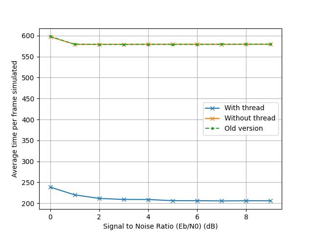
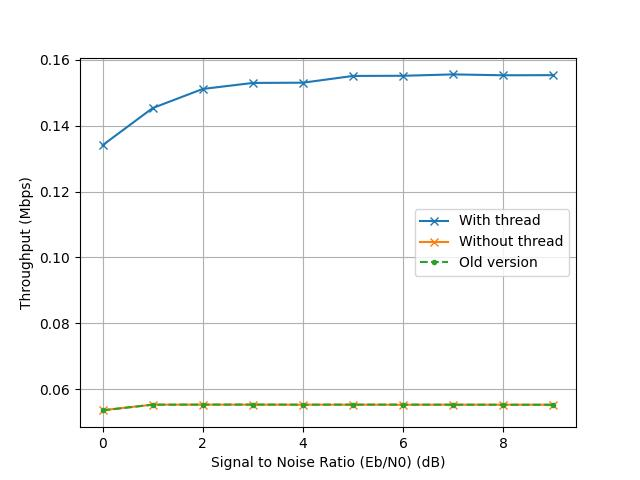
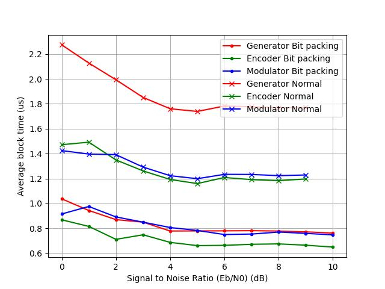

# Projet PPSE
DEBRIE Maëla
WILCOX Grace

# Preliminary note
We tested our code with both K=32 and K=128. On the graph, we were able to see that while the BER remained unchanged, the FER was affected by this modification, for our reference point as well as our optimized code. This is because one bit error only leads to one frame error, no matter the number of information bits. This means that for K=32, we have 32 chances of getting a bit error, while for K=128, we have 4 times more chances of having a bit error, leading to an increased frame error rate.

We also noted that our throughputs, global or per block, could greatly vary from one SNR to the next, leading to unclear results. While most of the time, we do have better throughput in our optimized versions, we decided it was more obvious to plot graphs based on the average time for the block / simulation chain instead of the throughput, so we reference those plots in this report. Throughput data can still be found in the .csv files and plotted in the `FINAL PLOTS` folder if so desired.

# Axe 1 - Speedup the whole chain
## Using threads
We will use mutex (locks) to avoid concurrent access on the frame error and bit error variables. Because we will run multiple threads at once, we might stop above `f_max` frames simulated.

To speed up the whole chain, we decided to be mono-thread for the reading of the command line parameters. For each SNR, we then initialize Es/N0 and sigma, before creating threads. Those threads will all do the do-while loop with the whole simulation chain. They all share the same `n_frame_simulated` variable, and they will return when they detect the total number of simulated frames is above f_max. Note that it might be above that number because several threads execute at the same time.
When all threads return, we then use the collected data to display the statistics in mono-thread.  
Because the Nano has 6 cores, we will launch 5 threads plus the initial process, so 6 threads in total.

Because of the way C threads work, we had to totally rearrange our code:
- A lot of our variables were made global. Because thread routines can't take arguments, that was the only way we could make our function pointers visible from one function (main) to another (routine).
- Because some of those global variables are susceptible of being manipulated by several threads at the same time, we created mutex to protect access to those variables. In order to write one of those variables, one thread should first acquire the corresponding mutex, then edit the value, and then release the mutex. This guarantees exclusive access. The time spent with a lock is reduced to the minimum.
  - To make those variables visible from the monitor function too (which manipulates the n_frame/bit_errors variables), we also declare mutex in this function, but as extern. That tells the compiler that those variables are guaranteed to exist, but defined in another file, that will later be linked together.
  - We also need locks for time manipulation and block statistics. We tried using local variables to measure time spent in a block, but that doesn't seem to work.
- The do-while loop is now in its own function, and that is the routine the threads will call upon creation.
- The `clock()` function we were using up to now to measure time seemed to add up the time spent in all threads: even if we could see the execution was quicker, our measures would tell us that the threads were taking 6x longer to execute a function. We changed the function used to measure time to `clock_gettime()` using the `CLOCK_REALTIME` to adapt to that. All of our timing measurements are in microseconds.

We also verified that our gestion of random was correct. We have only one random number generator, that all threads use. This way, when one thread polls a random number, the next thread polling a number from this same generator will not pull the same number.

**Testing**

Because we rearranged the whole code, we chose to use an earlier simulation to compare the performances. We then tested the code with and without threads to compare the performances.  
At first, we could see that the execution time with threads was higher than without threads. We reduced the number of threads and displayed the elapsed time after each SNR to see where the problem came from. We then saw that the time for only 1 function, not including threads, was bigger with threads compared to without threads ; that's how we noticed that our measuring method couldn't work with threads, causing us to switch time functions.  
To test our random generators, we displayed the generated frames and could see that they were different. We also tested the channel randomizer, by using the all ones modulator and printing the noisy output. We could also see that they were different.

*Source test*

*Channel test*


**Performances**

We first tested if our decoding performances were still correct. As mentionned, because we changed the structure of the code, we used an earlier simulation as a comparison point. We could see that both without and with threads had the same decoding performances as before, meaning our code is still correct.


We then compared the time spent for simulating one frame, as well as the throughput of one frame. The time went down and throughput increased for the thread version, although it is not exactly 6 times faster, presumably because of the locks slowdown.




# Axe 2 - Optimize one block

## Optimize modulator with SIMD
In order to optimize the modulator block, the original code is adapted to be used with neon SIMD functions. As a reminder, our modulator uses binary phase key shifting (BPSK) to transform a binary message to a symbol which is then converted to an integer value for transmission.
```
binary | symbol | integer
   0  ->   1   ->    1
   1  ->   0   ->   -1
```

Instead of parsing and converting the binary values one by one, the incoming binary codeword is treated 16 elements at a time by first loading 16 8-bit integers from memory into a vector. These 16 elements are then evaluated to determine whether they are a '1' or a '0' using the vectoral instruction `vcgtzq_s8`; the corresponding element in the 16-wide return vector is set to `0xFF = -1` if the input element was greater than 0, or to 0 otherwise. We can then manipulate this new vector by doubling it to create a difference of 2 between our two element types, and then adding one to shift these values, resulting in -1 or 1. This process is summarized below:
```
  in  | >0 ? |  x2  |  +1 
  0  ->  0  ->  0  ->  1 
  1  -> -1  -> -2  -> -1
```

It is of note that the input data type to the modulator is `uint8_t`, while the output is `int32_t`; the modulator must also convert each element from 8 to 32 bits. This process is facilitated using `vmovl` functions that allow for conversion between different width elements in SIMD. The complexity here, however, lies in the different length of each vector. Because the overall register size is constant, one SIMD register can only hold 4 32-bit integers. Therefore, four `int32x4_t` vectors are needed to hold the output produced by one `int8x16_t` vector. Additionnally, 2 16-element vectors are needed as intermediaries as the `vmovl` functions only provide conversion between adjacently sized vectors (8bit -> 16bit -> 32bit).

Once the modulated message has successfully been transferred to the 32 bit vectors, the result can be stored to the destination 32bit array.

Given that this implementation provides a third modulator option, the `--"mod-all-ones"` long option is replaced by `-o` which can take either `"mod-all-ones"` or `"mod-neon"`. If the `-o` option isn't used, the default, scalar BPSK modulator is used.

**Testing**

To test the functionality of the modulator, a simplified version of the simulator is used (`debug_func.c`) that allows for brief testing of the chain. This file also provides custom print statements to display both scalar and vectoral arrays in order to analyze the function at different point of execution. Displaying the array as it passed through the modulator exposed the issues surrounding the storage of the vector - which at first was attempted directly from the 8-bit vector to the 32-bit scalar array. The modulator was finally validated in comparing its output with the standard, scalar modulator:


**Performances**

Simulated using:
- random generator
- standard repetition encoder, 256 reps
- standard AWGN channel
- scalar demodulator
- float (scalar) decoder
- standard monitor

*Error rates* 

There is no difference in the error rates when using the neon and scalar modulator, as desired.

*Block timing*

The neon modulator is nearly 5x faster than its scalar counterpart.

## Optimize demodulator with SIMD
Similar to the modulator, a new version of the demodulator is proposed using vectorized instructions. The demodulator serves to normalize the noisy values coming out of the channel so that they sit in a similar range in that case that they need to be converted to fixed point. This is achieved by multiplying each element by 2/sigma^2, where the noise is proportionnal to sigma.

The input and output of the demodulator are both floating point arrays because this step comes _before_ the values are decoded back to binary. Thus, in order to retain the noise value for an accurate decode, floating point vectors are used for the normalization calculation. 

To use the SIMD demodulator, a long option `--demod-neon` is added. If not used, the default, scalar demodulator is kept.

**Testing**

Testing of the demodulator was performed the same as for the modulator, using the debug function to compare the vectorized demodulator with the original scalar version. 


**Performances**

Simulated using:
- random generator
- standard repetition encoder, 256 reps
- scalar modulator
- standard AWGN channel
- float (scalar) soft decoder
- standard monitor

*Errors rates*

There is no difference in the error rates when using the neon and scalar modulator, as desired.

*Block timing*

The vectorized version is slightly faster than the scalar demodulator, except for SNR 0. However, this SNR is an anomoly for both implementations, with a higher average time for both the scalar and vectorized versions. This may be explained by the fact that SNR 0 is the first SNR simulated which means that the very first frame occurs with this SNR. It is possible that there is a cache miss for the first frame to recover the demodulator code, which would be costly in terms of simulation time. In fact, this same phenomenom can be observed in the timing results for the modulator, though it is less pronounced since the scale is more zoomed out with the two implementations having a much bigger offset.

In terms of said offset, the gain in time with the neon instructions is significantly less than observed with modulator. This is not all that surprising, however, since the demodulator uses float vectors, which only hold 4 elements at a time, compared to the integer vectors used in the modulator (for the data manipulation part) that hold 16 elements. As such, the demodulator only treats 4 elements at a time, and though there is still a reduction in loop iterations, this reduction is much less significant than that of the modulator. Finally, the demodulator itself only consists of load, multiply, and store *floating point* operations, which are naturally more costly, especially in terms of arithmetic. This may contribute to the lack of gain with the neon instructions because floating point is used instead of previously seen integer-based vectors.

## Optimize monitor with SIMD
We want to speed up the monitor block, by treating 16 elements at a time. We will use SIMD for that.

We begin by computing the number of computations we'll have to do based on the array length (K, multiple of 16).  
Then, for each part of the array:
- We load the original and received messages
- We compare them using the `vceqq` function: if the values are equal, the result vector will contain a 1 ; if the values are different, it will contain a 9
- We want to count the differences: we add 1 to every element of the array. That way we have a 0 when the values were equal and a 1 when they are different
- We count the number of differences on this part of the array: we use `vaddvq_s8`, that sums the array values into a scalar value.
- We add this number, which is the number of bit errors, to the total bit error count.

If we have at least 1 error and we didn't yet add 1 to the frame error count (we use a flag to trace it), we then add 1 to the total number of frame errors.

We can use this variation using the command line, with the option `-c "monitor-neon"`

**Testing**

To test this monitor, we first use both monitors simultaneously: we add another set of variables to count the number of bit/frame errors, and we count the errors on a frame with both functions at the same time. They should produce the same results.

We first had an issue because we forgot to set those new variables to 0 before every SNR, so the values were different. Then, we had an error because we thought that equal values returned 0 in the result array, and different ones would be 1 ; but that was not the case, so we adapted the code.  
After that, we could see that both our monitors produced the same results:


**Performances**

We can see that this new monitor does not affect the performances, meaning it decodes well:


The time taken for the monitor is (most of the time) also reduced, as we can see on this graph:


## Bit-packing
Given that the simulation chain uses 1-bit data (other than when working with the noise of the channel), it is unnecessary to use a full byte for each piece of data. In order to reduce both time and memory usage, the generator, encoder, and modulator are all modified to support bit-packing, where data is treated 1 bit at a time - even though it is still stored in bytes (uint8_t). We note that all three of these new implementations use scalar (not SIMD) functions.

*Generator*

A new bit-packing version of the random number generator is added that does not use parity to reduce the value generated to 1 or 0. Already this is much more efficient, utilising all 8 bits of each array element, and reducing the computional load of the function significantly by omitting the modulo calculation. Additionally, this function only needs to produce 8 times less random numbers to provide the same amount of data as the original. This is not explicit in the function, but instead is evident in its usage in `simulator.c`.

*Encoder*

Like the generator, the encoder did not require much changing (or really any at all), because it essentially always does the same thing: repeat the given array as many times as necessary. However, a different version of the function was supplied to avoid the use of the modulo operator (at the price of using another for loop). The real gain from this new version of the encoder, however, again comes from its usage; it treats arrays 8 times smaller because of the higher information density from the bit packing, and therefore iterates less times.

*Modulator*

Upon exiting the modulator, the frame needs to be in a usable format for the channel - not bit-packed. Therefore, a new modulator is proposed that unpacks the condensed format codeword while modulating it. This involves a nested for loop in order to treat each bit of each element of the input array, using shifted bit masking to extract the desired bit. The modulation is still BPSK, converting 0 to 1 and 1 to -1.

In order to use this in the full simulation chain, the final decoded frame needs to be repacked to properly compare it with the generator frame in the monitor. The function `bit_packer` in `decode.c` uses shifting and bitwise OR to place each element of the decoded frame into a bit-packed output. Lastly, integrating this optimization into our simulation chain involved adding a command line option `-p` that ensures that the bit-packed generator, decoder, and modulator are used, even if other, conflicting command line options are selected. Any demodulator and decoder can be used, and the bit-packer is added at the end before passing the final frame to the monitor. New logic was also added to reduce the size of the generated (U_K) and encoded (C_N) frame arrays on declaration.

**Testing**

Once again, the simplified simulation chain `debug_func.c` was used to test each of the new functions proposed. A binary print function was added to facilitate testing of the packed-format and to easily compare with the modulated (unpacked) versions. 


**Performances**

Simulated using:
- bit packed generator
- bit packed encoder, 4 repetitions
- bit packed modulator
- standard AWGN channel
- float (scalar) soft decoder
- standard monitor

*Error rates*

The error rates remain unchanged when using bit packing, as desired.

*Block timing*

Because bit-packing involves the generator, encoder, and modulator, the timing of all three blocks is shown with and without the optimization. All three blocks are faster with bit-packing, with the most evident change in the generate function. Unsurprisingly, reducing the amount of generate iterations by a factor of 8 has a signficant change in timing as it reduces calls to the random number generator by the same amount. These calls are undoubtedly costly - referencing external libraries, intense math calculations for a random number - hence the impressive gain in cutting iterations from the generate block.